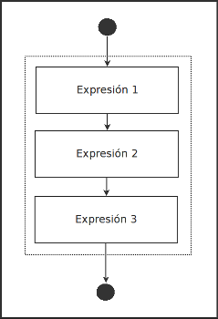
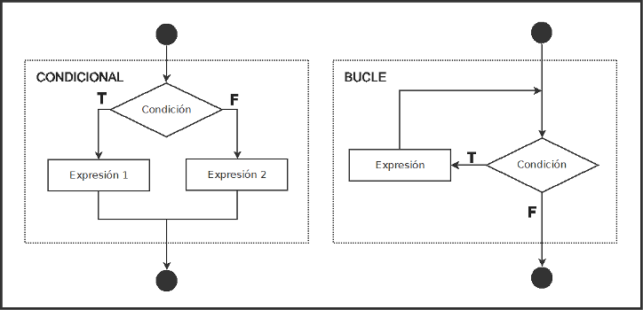

# Control de flujo

Las aplicaciones escritas en C se ejecutan de manera sequencial, una instrucción tras otra, como lo podemos ver en el siguiente diagrama:

En muchísimas situaciones nos interesa controlar este flujo de ejecución en la aplicación para que se ejecuten sólo ciertas partes del código, que se repitan varias veces otras, etc.

Existen dos tipos de expresiones para controlar el flujo de la aplicación, estas son:

- Condicionales: ejecutan un bloque de código si se cumple una condición.
- Bucle: ejecutan un bloque de código una y otra vez mientras se cumpla un condición, o no.

