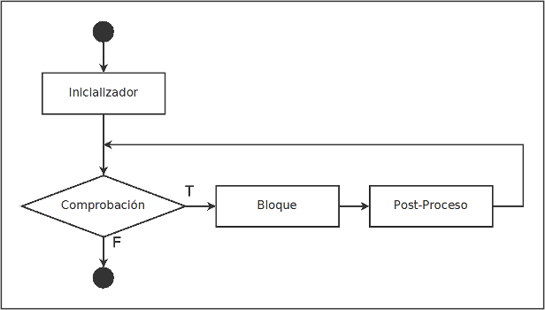
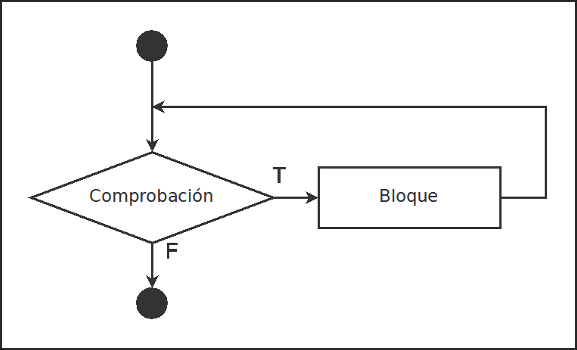
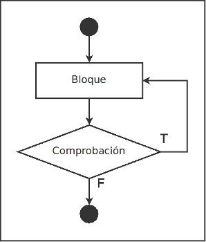

# Bucles

Los bucles son sentencias de control que permiten al programador que se repita un bloque de código el número de veces que estime oportuno mientras se cumpla una condición.

Los sentencias de bucles presentes en **C** son: for, while, do while.

## `for`

El bucle `for` empieza con un **inicializador** y realiza un **comprobación**. Si esta se cumple ejecuta un **bloque de código** y la sentencia **post-proceso**, entonces vuelve a realizar la comprobación repitiendo el bucle hasta que la comprobación falle.

La sintaxis y el flujo de trabajo es:

````c
for (inicializador; comprobacion; post-proceso) {
    // Bloque de código
}
````



Ejemplo, vamos a mostrar una lista de números consecutivos del 1 al 10.

````c
int i;

printf("Lista de números: ");
for (i = 1; i <= 10; i++) {
    printf("%i", i);
}
````

Salida:

````text
Lista de números: 1 2 3 4 5 6 7 8 9 10
````

## `while`

El bucle `while` ejecuta un **bloque de código** mientras **comprobación** sea cierta.

La sintaxis y el flujo de trabajo sería:

````c
while (comprobacion) {
    // Bloque de código
}
````



Ejemplo, realizamos a un usuario una pregunta y le damos la opción 1 y 2, si no teclea el número 1 ó 2, le muestra un mensaje de error y repite la pregunta:

````c
int selector;

printf(
    "Opciones:\n"
    "1. Aprender C básico.\n"
    "2. Aprender C avanzado.\n"
    "Escoja [1, 2]: "
);
scanf("%i", &selector);

while (selector != 1 || selector != 2) {
    printf(
        "Opción no válida.\n"
        "Escoja [1, 2]: "
    );
    scanf("%i", &selector);
}
````


## `do while`

El bucle `do while` ejecuta un **bloque de código**, entonces realiza una **comprobación** y se cumple volverá a ejecutar el bloque.

La sintaxis y el flujo de trabajo sería:

````c
do {
    // Bloque de código
} while (comprobacion);
````



Ejemplo, realizamos a un usuario una pregunta y le damos la dos opciones y si no teclease 1 ó 2, le repite la pregunta.

````c
int selector;

printf(
    "Opciones:\n"
    "1. Aprender C básico.\n"
    "2. Aprender C avanzado.\n"
);

do {
    printf("Escoja [1, 2]: ");
    scanf("%i", &selector);
} while (selector != 1 || selector != 2);
````
