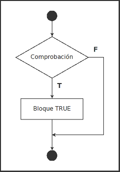
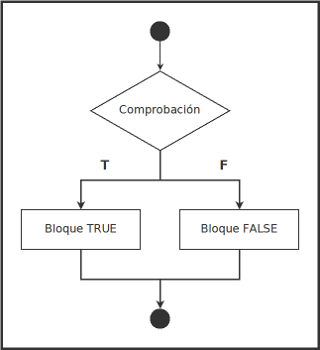
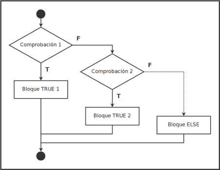
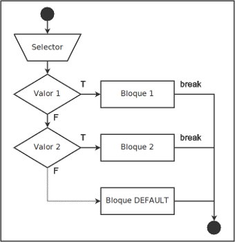

# Condicionales

Los condicionales son expresiones que en el caso de que se cumpla una condición, o no, ejecutan un bloque de código.

Los tipos de sentencias condicionales son:

- `if`
- `if else`
- `if else if`
- `switch case`

## `if`

En la sentencia condicional `if`, si se cumple una condición, se ejecuta un bloque de código, si no, no se ejecuta.

La sintaxis y el flujo de trabajo sería:

````c
ìf (comprobacion) {
    // Bloque TRUE
}
````



Veamos con un ejemplo:

````c
int x = 5;

if (x == 5) {
    // si X equivale a 5 se ejecuta este bloque
    printf("X es igual a 5");
}
````

## `if else`

Al condicional `if` podemos añadirle `else` para ejecutar un bloque en el caso de que no se cumpla la condición.

La sintaxis y el flujo de trabajo sería:

````c
ìf (comprobacion) {
    // Bloque TRUE
} else {
    // Bloque FALSE
}
````



Ejemplo:

````c
int x = 8;

if (x == 5) {
    // si X equivale a 5 se ejecuta este bloque
    printf("X es igual a 5");
} else {
    // si no, se ejecuta este otro
    printf("X no es igual a 5");
}
````

## `if else if`

Al condicional `if else` podemos añadirle la expresión `else if` para ejecutar un bloque en el caso de que querramos añadir más condiciones cuando no se cumpla la inicial.

La sintaxis y el flujo de trabajo sería:

````c
ìf (comprobacion 1) {
    // Bloque TRUE 1
} else if (comprobacion 2) {
    // Bloque TRUE 2
} else {
    // Bloque ELSE
}
````



Ejemplo:

````c
int x = 10;

if (x == 5) {
    // si X equivale a 5 se ejecuta este bloque
    printf("X es igual a 5");
} else if (x > 5) {
    // si X no es 5, se comprueba si es mayor a 5 y se ejecuta este bloque si fuese
    printf("X es mayor a 5");
} else if (x < 5) {
    // si X no es igual o mayor 5, se comprueba si es menor a 5 y se ejecuta este bloque si fuese
    printf("X es menor a 5");
} else {
    // si no se cumpliera ninguno de los casos
    printf("¿Existe X?");
}
````

## `switch case`

El condicional `switch case` es una alternativa a `if else if` en la que se recoge un dato en una variable (la llamaremos `selector`) y dependiendo de su valor se ejecuta un bloque de código entre varias opciones.

La sintaxis y el flujo de trabajo es:

````c
switch(selector) {
    case valor1;
        // Bloque 1
        break;
    case valor2;
        // Bloque 2
        break;
    default:
        // Bloque DEFAULT
}
````



Veamos como ejemplo un uso típico del condicional `switch case`, un menú de aplicación que da a elegir entre varias opciones y, dependiendo de lo que se seleccione, ejecutará un bloque de código u otro:

````c
int selector;

printf(
    "Menú de aplicación:\n"
    "1. Mostrar X.\n"
    "2. Mostrar Y.\n"
    "3. Mostrar Z.\n"
    "Escoja opción: "
);
scanf("%i", %selector);

switch (selector) {
    case 1:
        printf("X es ...");
        break;
    case 2:
        printf("Y es ...");
        break;
    case 3:
        printf("Z es ...");
        break;
    default:
        printf("Opción erronea");
}
````

Es necesario el uso de la expresión `break` por cada `case` para indicar que no se continue ejecutando de manera secuencial el resto del bloque `switch`.

El caso `default` será el que se ejecutará cuando el usuario haya introducido un dato que no coincida con los establecidos.

>**IMPORTANTE**: Por lo general, es utilizado `switch case` por ser una opción sintácticamente más limpia y fácil de leer que `if else if` pero tiene la desventaja de que sólo sirve para valores concretos. Por ejemplo, no podría plantear el caso `x > 5`.


